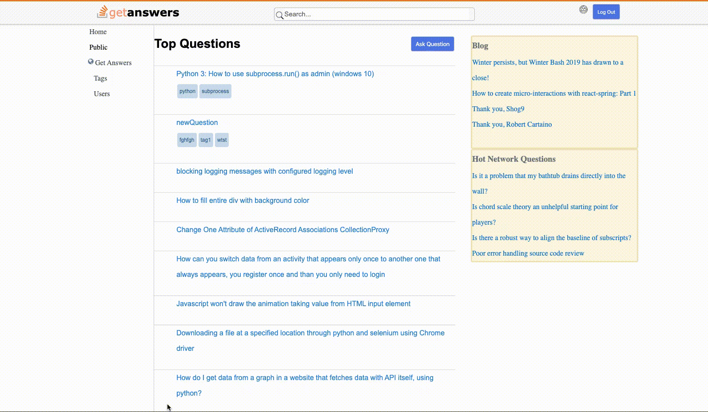

# getAnswers

# Table of Contents

  1.Introduction
  
  2.Features
  
  3.Technologies
  
  4.Live Website
  
  5.Future Enhancements

# Introduction
  
  getAnswers is a clone of Stack Overflow, question and answer based website related to software technology. On this site users are able to create new accounts, questions and post an answer for a question.
  
  

# Features and MVPs

## SignUp, Login
  
  * Users can sign up to create an account
  * Signed up user can login to their account

## Questions

  * Logged in user can ask a question wanting to get an answer, rich text can be used for body of the question
  * Can create question with tags attached to it
  * Question owner can edit/delete question
  
    
    
    ```ruby on rails
    
    def tag_names=(tag_names)   
        self.tags = tag_names.map do |tag|
           Tag.find_or_create_by(name: tag)
        end
    end
    
    ```

  
## Answer
  
  * Any logged in user can answer a question with rich text features
  * Each answer displayed with username


## Search Questions

  * User can search questions based on title or tags

    


```javascript
  componentDidUpdate() {
    
    if (this.state.searchTerm !== this.props.match.params.searchTerm) {
        this.props.search(this.props.searchTerm)
            .then(() => this.setState({
            searchTerm: this.props.searchTerm
        }));
    } 
    }
```
# Technologies

* Front-End: `React`, `Redux`
* Back-End: `Ruby on Rails`, `PostgresSQL`

# Live Website

[GetAnswers](https://get-ans.herokuapp.com/#/) live website

# Future Enhancements

* implement a logic that allows users to up/down vote a question/answer
* create user profile with picture


